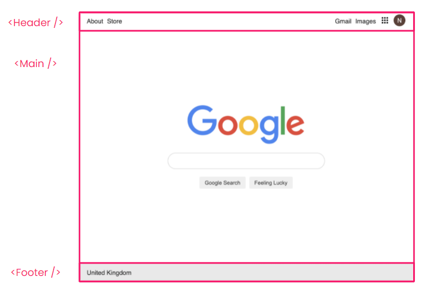

# React Components Intro

In this exercise, you are going to breakdown a mock up of the Google homepage in to separate React components.

## Set up
1. Fork and clone this repository
3. Run `npm install` to installs dependencies for the project. You may see warnings about `deprecated` packages and vulnerabilities. You can ignore these.
4. Run `npm start` to start the local development server that runs your website in the browser.

## Instructions
* Extract the Header, Main and Footer sections in to their own React components

## Extension
* See what additional components you can extract from each of those sections
